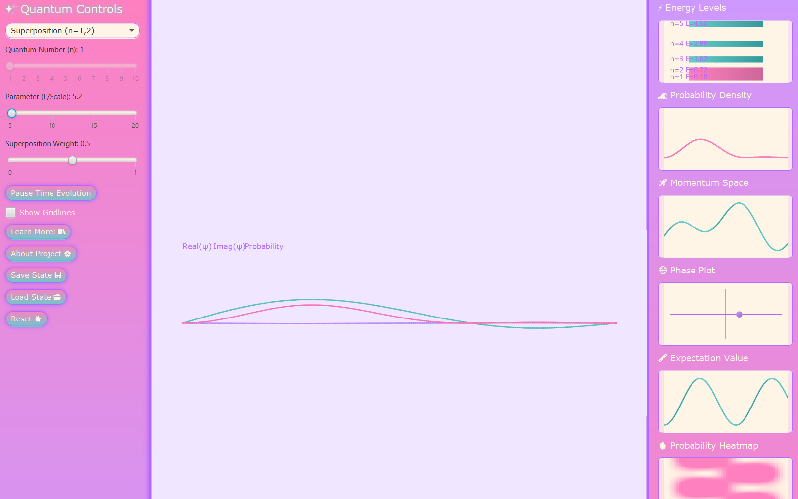
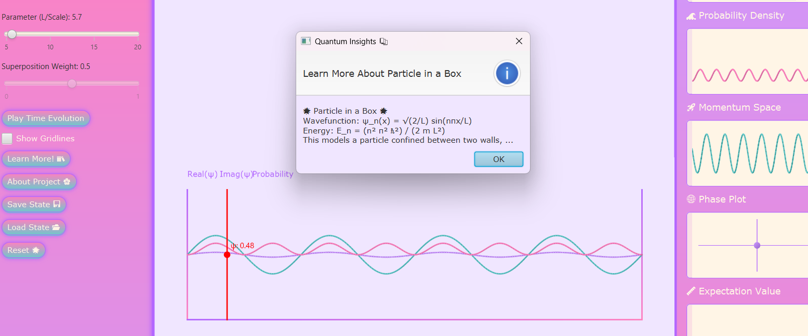

<h1 align="center">
  🌌 QuantumBloomStudio
</h1>

<p align="center">
  <em>“Where quantum meets canvas”</em><br>
  <strong>An immersive, interactive JavaFX application for visualizing quantum mechanics.</strong>
</p>

<p align="center">
  
  
  
  
</p>

---

## 🪐 Overview
**QuantumBloomStudio** is a beautiful, dark-themed JavaFX-based educational tool to intuitively explore quantum mechanical systems. It brings wavefunctions, energy levels, and probability densities to life.

---

## ✨ Features
- **Live Wavefunction Visualization** — Real, Imaginary, and Probability Density
- **Multiple Quantum Systems** — Particle in a Box, Harmonic Oscillator, and Superposition States
- **Time Evolution** — Animate quantum states with pause/resume control
- **Dynamic Control Panel** — Modify quantum number \(n\), box length \(L\), and superposition weights
- **Auxiliary Plots** — Energy levels, phase space, momentum space, expectation values, and heatmaps
- **Save/Load State** — Reuse and share quantum scenarios
- **Educational Dialogs** — Equations and insights explained with visuals
- **Aesthetic UI** — Sleek violet-magenta gradient theme with soft drop shadows

---

## 🌸 Quantum Bloom Studio Demo



See the interactive quantum visualizations below 👇  

)

> 🎥 **GIF Demo Coming Soon!**

---

## 🛠️ Prerequisites
- **Java JDK**: 17+
- **JavaFX SDK**: 17+ (Download from [GluonHQ](https://gluonhq.com/products/javafx/))
- **Windows OS**: Recommended (adjust `.bat` for other OS)

---

## 🚀 Setup & Run

```bash
# Clone the repository
git clone https://github.com/your-username/QuantumBloomStudio.git
cd QuantumBloomStudio
```

### 1. Configure `compiler.bat`
```bash
javac --module-path "C:\\javafx-sdk-17\\lib" --add-modules javafx.controls,javafx.fxml QuantumBloomStudio.java
```

### 2. Configure `run.bat`
```bash
java --module-path "C:\\javafx-sdk-17\\lib" --add-modules javafx.controls,javafx.fxml QuantumBloomStudio
```

### 3. Compile & Run
```bash
compiler.bat
run.bat
```

---

## 🧾 Folder Structure
```
QuantumBloomStudio/
├── QuantumBloomStudio.java
├── compiler.bat
├── run.bat
├── screenshots/
│   ├── screenshot_dark1.png
│   └── screenshot_dark2.png
└── README.md
```

---

## 🧪 Roadmap
- [ ] Add dark mode toggle
- [ ] Export wavefunction plots
- [ ] Include quantum tunneling visualization
- [ ] Add support for Linux/Mac launch scripts
- [ ] Add detailed educational popups with LaTeX math

---

## 👩‍💻 Author
**[Your Name]** — [GitHub](https://github.com/your-username)

Feel free to fork, star, or submit pull requests!

---

## 📄 License
This project is licensed under the MIT License — see the [LICENSE](LICENSE) file for details.

---

## 📬 Contact
Found a bug or have suggestions? Open an issue or email: [your-email@example.com]

---

> “Happy quantum exploring!” 🌟
